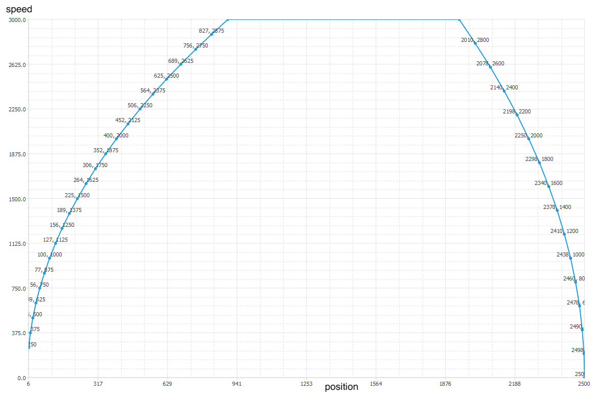

# AccelDecel 
࿗ is a well-tested calculator of linearly accelerated and decelerated motion.  
࿘ это ладно проверенный калькулятор равноускоренного движения.

It calculates the positions at which motor speed should be changed. Usually it is enough to change speed from 100 to 10 times per second. Change speed after every step is inefficient.

༄ The calculator itself is a one-header class.

࿐ Supplied with Qt project to show chart.




Motion parameters are set in `main.cpp`:
```
mo.accel = 5000;
mo.decel = 8000;
mo.speedUpdatePeriod_ms = 25;
mo.initialPosition = -0;
mo.targetPosition = 2500;
mo.wantedSpeedAfterAccel = 3000;
```

For more details see the simpliest example [`main-stdout.cpp`](main-stdout.cpp).  
Here its output.
```
Hello, Motion!

mo:{
  dV_accel_:     150
  dV_decel_:     150
  Vc_:          6000
  Xa_:          6000
  Xc_:         42200
  Xb_:          3000
  Ta_:             2
  Tc_:       8.03333
  Tb_:             1
}

vecVx
posSpd:{ pos:     15, spd:    300 }
posSpd:{ pos:     34, spd:    450 }
posSpd:{ pos:     60, spd:    600 }
posSpd:{ pos:     94, spd:    750 }
posSpd:{ pos:    135, spd:    900 }
....
posSpd:{ pos:  51170, spd:    600 }
posSpd:{ pos:  51193, spd:    300 }
posSpd:{ pos:  51200, spd:      0 }
vec.size(): 60
```

### Requirements
For calculator itself only `C++14` required and it is suitable for embedded devices like microcontrollers. It successfully works on ARM Cortex-M3, M4, M7.  
To build and run project on desktop with chart you need Qt-5.9 or later. Earlier versions not tested.

# CROSS PLATFORM
Works well under Windows, Ubuntu Linux 16, and embedded uC Cortex-M7.

# Build with QMake
```
cd /path/to/my/workspace
git clone https://gitlab.com/kyb/accdecel.git
cd accdecel
mkdir build-qmake  &&  cd build-qmake
qmake ..
make
./accdecel
```
**Enjoy!**
